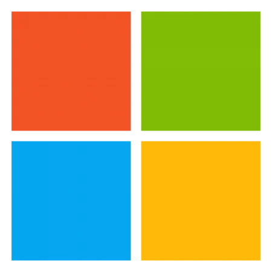

# Lesson 9 - Turtles Graphic  

Let’s try a couple of lines of Python code to create a new turtle and start drawing a simple figure like a rectangle. We will refer to our first turtle using the variable name alex, but remember that you can choose any name you wish as long as you follow the naming rules from the previous chapter.

The program as shown will only draw the first two sides of the rectangle. After line 4 you will have a straight line going from the center of the drawing canvas towards the right. After line 6, you will have a canvas with a turtle and a half drawn rectangle. Press the run button to try it and see.

#python
import turtle             # allows us to use the turtles library
wn = turtle.Screen()      # creates a graphics window
alex = turtle.Turtle()    # create a turtle named alex
alex.forward(150)         # tell alex to move forward by 150 units
alex.left(90)             # turn by 90 degrees
alex.forward(75)          # complete the second side of a rectangle

#

"""
Here are a couple of things you’ll need to understand about this program.

The first line tells Python to load a module named turtle. That module brings us two new types that we can use: the Turtle type, and the Screen type. The dot notation turtle.Turtle means “The Turtle type that is defined within the turtle module”. (Remember that Python is case sensitive, so the module name, turtle, with a lowercase t, is different from the type Turtle because of the uppercase T.)

We then create and open what the turtle module calls a screen (we would prefer to call it a window, or in the case of this web version of Python simply a canvas), which we assign to variable wn. Every window contains a canvas, which is the area inside the window on which we can draw.

In line 3 we create a turtle. The variable alex is made to refer to this turtle. These first three lines set us up so that we are ready to do some drawing.

In lines 4-6, we instruct the object alex to move and to turn. We do this by invoking or activating alex’s methods — these are the instructions that all turtles know how to respond to.
"""

## Other

#### Microsoft Logo

